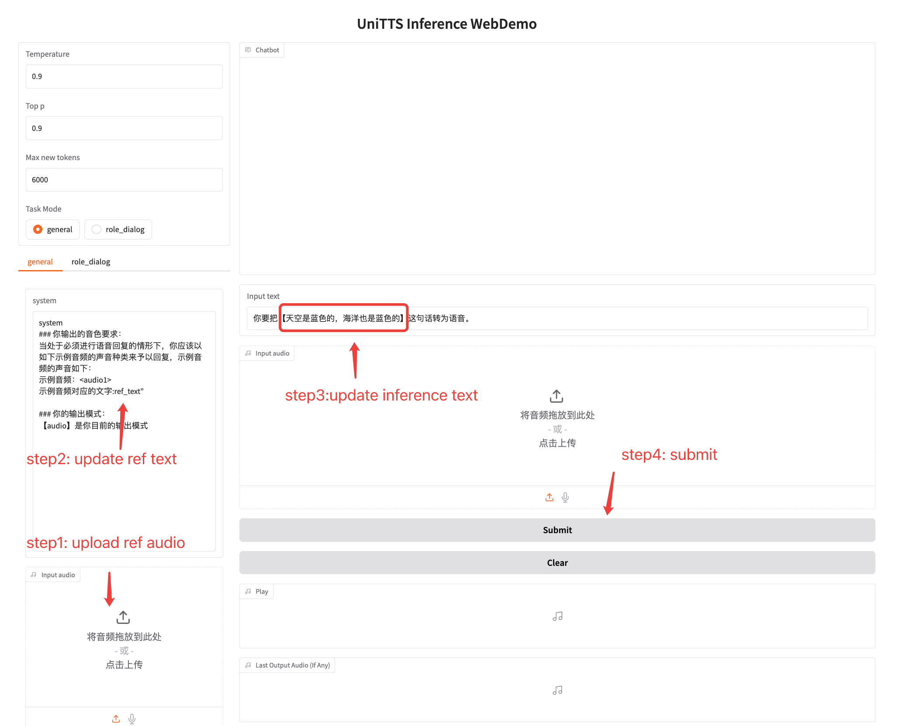

<div align="center">
    <h1>
    UniTTS
    </h1>
    <p>
    <b><em>UniTTS: An end-to-end TTS system without decoupling of acoustic and semantic information</em></b>
   </p>
    <p>
    </p>
    </p>
    <a href="https" style="color:red">Paper</a> |  
    <a href="https://huggingface.co/IDEA-Emdoor/UniTTS-mixed-v0.1" style="color:#FFD700">Hugging Face Model</a>  |
    <a href="https://github.com/IDEA-Emdoor-Lab/UniTTS?tab=readme-ov-file" style="color:gray">Code</a>
     <p>
        
    </p>
     <p>
        
        
    </p>
</div>


## Overview

we introduce UniTTS and [DistilCodec](https://github.com/IDEA-Emdoor-Lab/DistilCodec/tree/dev?tab=readme-ov-file) . DistilCodec is a single-codebook audio codec, which has 32768 codes, and the utilization of the codebook achieves nearly 100\%. UniTTS leverages DistilCodec for audio discretization, while its backbone network adopts Qwen2.5-7B to model relationships between audio tokens. 

Our main contributions are summarized as follows:

  - DistilCodec: We propose a training methodology that enables the distillation of multi-codebook Neural Audio Codecs(NAC) into single-codebook NAC. Through this approach, we have developed DistilCodec - a single-codebook NAC containing 32,768 codes that achieves 100\% utilization with balanced code distribution. Notably, DistilCodec employs universal audio data for training rather than being restricted to speech-specific datasets.
  - UniTTS: We present UniTTS, a novel TTS system trained on QWen2.5-7B and DistilCodec. Leveraging DistilCodec's comprehensive audio modeling capabilities, UniTTS achieves end-to-end speech synthesis with full-spectrum audio input/output. The system demonstrates enhanced naturalness in emotional expressiveness compared to conventional TTS systems, particularly in capturing subtle prosodic variations and affective nuances during audio generation. 
  - Novel Audio Language Model Paradigm: We establish a dual-phase Audio Language Model (ALM) training framework, which comprises (i) Audio Perceptual Modeling (DistilCodec) focusing purely on acoustic discretization, and (ii) Audio Cognitive Modeling (UniTTS) implemented via pretraining (incorporating universal audio autoregressive tasks), supervised fine-tuning (evaluating text-audio interleaved prompts' impact), and alignment (employing direct preference optimization for speech refinement) - enabled by UniTTS's complete end-to-end integration within the LLM.

The architecture of UniTTS is illustrated in the figure below. .

## Roadmap
- [done]  [DistilCodec](https://github.com/IDEA-Emdoor-Lab/DistilCodec/) has finished training and has been open-sourced.
- [done]  UniTTS-v0.1 is available, supporting text conversations, long-CoT, and Chinese TTS.
- [undo]  UniTTS-v0.2 supports multiple languages including Chinese and English, with enhanced emotional speech synthesis capabilities.
- [undo] Scale UniTTS into an end-to-end S2S system within feasible computational limits.

## Training data distribution and application scope
The model architecture was augmented with cross-lingual text-speech paired datasets (English and Chinese) alongside text-associated instruction corpora during pretraining. Subsequent SFT and alignment phases systematically incorporated three datasets: text instructions dataset, long-CoT dataset, and Chinese TTS dataset. Consequently, the model demonstrates robust capabilities in text-based conversational, long-CoT conversational, and Chinese TTS.

The distribution of the pretraining training data is as follows:
| Data Type                  | Data Size (B) |
|----------------------------|---------------|
| Text Data                  | 140           |
| Text-Audio Alignment Data  | 82            |
| Audio Data                 | 100           |
| **Total**                  | **322**       |

The distribution of the sft training data is as follows:

| Data Type                  | Number of Samples |
|----------------------------|-------------------|
| Text Data                  | 181K              |
| Long-cot Dataset           | 55K               |
| Chinese Text-Audio Alignment Data  | 401K              |
| Total                      | 637K              |

The distribution of the lpo training data is as follows:

| Data Type                  | Number of Samples |
|----------------------------|-------------------|
| General SFT Data           | 100K              |
| Long-cot Dataset           | 45K               |
| Chinese Text-Audio Alignment Data  | 300K              |
| Total                      | 445K              |

The proposed model supports the following capabilities

|     Application Type       | Support Status    |
|----------------------------|-------------------|
| Text conversation          | Supported           |
| Long-cot conversation      | Supported           |
| Chinese TTS                | Supported           |

## Available models
Qwen2.5-7B-ExtVocab is an enhanced version of the Qwen2.5-7B model, extended with additional audio tokens for training purposes. UniTTS-mixed-v0.1, developed through a three-stage training process for inference.
|Model Version| Huggingface |  Application |
|-----------------------|---------|-----------------------------------|
| Qwen2.5-7B-ExtVocab | [HuggingFace](https://huggingface.co/IDEA-Emdoor/Qwen2.5-7B-ExtVocab) | For Pretrain |
| UniTTS-mixed-v0.1   | [HuggingFace](https://huggingface.co/IDEA-Emdoor/UniTTS-mixed-v0.1)   | Chinese TTS infernce/text dialogue/long-cot |

## Install
**Clone and Install**

- Clone the repo
``` sh
git clone git@github.com:IDEA-Emdoor-Lab/UniTTS.git
git clone git@github.com:IDEA-Emdoor-Lab/DistilCodec.git
cd UniTTS
```

- Installation environment
``` sh
conda create -n unitts -y python=3.10
conda activate unitts
pip install -r requirements.txt
```


**Model Download**

Download via git clone:
```sh
mkdir -p pretrained_models

# Make sure you have git-lfs installed (https://git-lfs.com)
git lfs install

# clone UniTTS model
git clone git@hf.co:IDEA-Emdoor/UniTTS-mixed-v0.1
```

## Training Usage

We have open-sourced our three-stage training code, including pre-training, SFT, and LPO. Our training code is built upon the pai-megatron-patch with optimizations. For usage instructions on pre-training and SFT training, please refer to the following [README](pai-megatron-patch/examples/qwen2_5/README.md).


## Inference Usage
### TTS Inference Usage

```
#### Step 1:  Init model

from cli.tokenizer import QWenTokenizer
from cli.tts_tool import enocde_audio, tts_prompt_ref_text
import soundfile as sf
import librosa
from vllm import LLM, SamplingParams

import sys
sys.path.append(Distilcodec code path) # set DistilCodec code path
from distil_codec import DistilCodec # type: ignore

#init model
model_name="IDEA-Emdoor/UniTTS-mixed-v0.1"
model_config="IDEA-Emdoor/UniTTS-mixed-v0.1/codec_config.json"
ckpt_config="IDEA-Emdoor/UniTTS-mixed-v0.1"

ref_audio_path='cli/ref.mp3'
ref_text='求求你，再给我一次机会，我保证不会让你失望……'
infer_text='天啊！这竟然是真的？我简直不敢相信！'


llm = LLM(model=model_name, dtype='auto', gpu_memory_utilization=0.8, seed=0)   
codec = DistilCodec.from_pretrained(
    config_path=model_config,
    model_path=ckpt_config,
    use_generator=True,
    is_debug=False,
    local_rank=0).eval()

tokenizer: QWenTokenizer = QWenTokenizer(model_name)
stop_tokens = ["<|endoftext|>", "<|endofaudio|>", "<|im_end|>"]
stop_ids = tokenizer.tokenizer.convert_tokens_to_ids(stop_tokens)

#### Step 2: format prompt

ref_audio_text = enocde_audio(codec, tokenizer, ref_audio_path)
ref_audio_text = f'<|inter_audio_begin|>{ref_audio_text}<|inter_audio_end|>'
prompt = tts_prompt_ref_text.format(content=infer_text, example_voice=ref_audio_text, example_text=ref_text)

#### Step 3: inference speech token
sampling_params = SamplingParams(temperature=0.9, top_p=0.9, stop_token_ids=stop_ids, max_tokens=6000)
output = llm.generate([prompt], sampling_params)

#### step 4: decode speech token

output_dir='./' # save path
tokens = tokenizer.tokenizer.encode(output[0].outputs[0].text)[1: -2]
utt = 'infer'
y_gen = codec.decode_from_codes(
    tokens, 
    minus_token_offset=True # if the 'plus_llm_offset' of method demo_for_generate_audio_codes is set to True, then minus_token_offset must be True.
)
codec.save_wav(
    audio_gen_batch=y_gen, 
    nhop_lengths=[y_gen.shape[-1]], 
    save_path=output_dir,
    name_tag=utt
)

```

### Long-cot Inference Usage
```
#### Step 1:  Init model

from cli.tokenizer import QWenTokenizer
from cli.tts_tool import enocde_audio, long_cot_prompt_template
from vllm import LLM, SamplingParams


#init model
model_name="IDEA-Emdoor/UniTTS-mixed-v0.1"
infer_text="给我写一首春天的作文"
llm = LLM(model=model_name, dtype='auto', gpu_memory_utilization=0.8, seed=0)   

tokenizer: QWenTokenizer = QWenTokenizer(model_name)
stop_tokens = ["<|endoftext|>", "<|endofaudio|>", "<|im_end|>"]
stop_ids = tokenizer.tokenizer.convert_tokens_to_ids(stop_tokens)

#### Step 2: format prompt

prompt = long_cot_prompt_template.format(question=infer_text)

#### Step 3: inference speech token
sampling_params = SamplingParams(temperature=0.8, top_p=0.8, stop_token_ids=stop_ids, max_tokens=6000)
output = llm.generate([prompt], sampling_params)

print(output[0].outputs[0].text)

```

### Text conversation Inference Usage

```
#### Step 1:  Init model

from cli.tokenizer import QWenTokenizer
from cli.tts_tool import enocde_audio, text_conversation_prompt_template
from vllm import LLM, SamplingParams


#init model
model_name="IDEA-Emdoor/UniTTS-mixed-v0.1"

infer_text="天空为什么是蓝色的？"
llm = LLM(model=model_name, dtype='auto', gpu_memory_utilization=0.8, seed=0)   

tokenizer: QWenTokenizer = QWenTokenizer(model_name)
stop_tokens = ["<|endoftext|>", "<|endofaudio|>", "<|im_end|>"]
stop_ids = tokenizer.tokenizer.convert_tokens_to_ids(stop_tokens)

#### Step 2: format prompt

prompt = text_conversation_prompt_template.format(question=infer_text)

#### Step 3: inference speech token
sampling_params = SamplingParams(temperature=0.75, top_p=0.75, stop_token_ids=stop_ids, max_tokens=6000)
output = llm.generate([prompt], sampling_params)

print(output[0].outputs[0].text)

```

## Web UI
You can launch a web page for more convenient testing.
```
model_path=$1     # IDEA-Emdoor/UniTTS-mixed-v0.1
model_config=$2   # IDEA-Emdoor/UniTTS-mixed-v0.1/codec_config.json
ckpt_config=$3    # IDEA-Emdoor/UniTTS-mixed-v0.1

use_vllm=true

# Note: Set the downloaded DistilCodec path in webdemo_audio_english.

CUDA_VISIBLE_DEVICES=6 python webdemo_audio_english.py \
    --host 0.0.0.0 \
    --port 8893 \
    --model_config $model_config \
    --ckpt_config $ckpt_config \
    --model_path $model_path \
    --demo_url /demo/541833 \
    --api_url /api/demo/541832 \
    --use_vllm $use_vllm
```

| WebUI DEMO |
|-------------|
|  |

## **Demos**

### TTS  demos

Our model can generate audio that maintains the timbre of the reference audio while producing emotionally expressive output tailored to the context of the target sample. Here are some demos generated by UniTTS. 

| Ref Audio | Inference Text (中/英) | Inference Audio |
|-----------|-----------------------|-----------------|
| <audio controls src="./demos/voice0/system_audio.wav"><a href="./demos/voice0/system_audio.wav">Download</a></audio> | 求求你…不要离开我，我真的好害怕…<br/>Please... don't leave me, I'm so scared... | <audio controls src="./demos/voice0/infer_0.wav"><a href="./demos/voice0/infer_0.wav">Download</a></audio> |
| <audio controls src="./demos/voice1/system_audio.wav"><a href="./demos/voice1/system_audio.wav">Download</a></audio> | 天啊！这竟然是真的？我简直不敢相信！<br/>Oh my god! This is actually true? I can't believe it! | <audio controls src="./demos/voice1/infer_1_1.wav"><a href="./demos/voice1/infer_1_1.wav">Download</a></audio> |
| <audio controls src="./demos/voice2/system_audio.wav"><a href="./demos/voice2/system_audio.wav">Download</a></audio> | 立刻停止你的行为！这是最后的警告！<br/>Cease your actions immediately! This is the final warning! | <audio controls src="./demos/voice2/infer_2_1.wav"><a href="./demos/voice2/infer_2_1.wav">Download</a></audio> |
| <audio controls src="./demos/voice3/system_audio.wav"><a href="./demos/voice3/system_audio.wav">Download</a></audio> | 天啊！这绝对是我见过最不可思议的画面！<br/>Good heavens! This is by far the most incredible scene I've ever witnessed! | <audio controls src="./demos/voice3/infer_3_1.wav"><a href="./demos/voice3/infer_3_1.wav">Download</a></audio> |
| <audio controls src="./demos/voice4/system_audio.wav"><a href="./demos/voice4/system_audio.wav">Download</a></audio> | 你怎么能这样对我？我简直无法忍受！<br/>How could you do this to me? I simply can't bear it! | <audio controls src="./demos/voice4/infer_4_1.wav"><a href="./demos/voice4/infer_4_1.wav">Download</a></audio> |
| <audio controls src="./demos/voice5/system_audio.wav"><a href="./demos/voice5/system_audio.wav">Download</a></audio> | 今天的阳光真温暖，公园里的花开得特别灿烂！！<br/>The sunshine is so warm today, and the flowers in the park are blooming brilliantly! | <audio controls src="./demos/voice5/infer_5_1.wav"><a href="./demos/voice5/infer_5_1.wav">Download</a></audio> |
| <audio controls src="./demos/voice6/system_audio.wav"><a href="./demos/voice6/system_audio.wav">Download</a></audio> | 可是，她有一个不太好看的孩子，这个孩子被送到了挖沟工人的老婆家里抚养。而安妮·莉斯贝自己呢，住进了伯爵的公馆。<br/>However, she had an unattractive child who was sent to be raised by the wife of a ditch digger. As for Anne Lisbeth herself, she moved into the count's mansion. | <audio controls src="./demos/voice6/infer_6_1.wav"><a href="./demos/voice6/infer_6_1.wav">Download</a></audio> |
| <audio controls src="./demos/voice7/system_audio.wav"><a href="./demos/voice7/system_audio.wav">Download</a></audio> | 求求你…不要离开我，我真的好害怕…<br/>Please... don't leave me, I'm so scared... | <audio controls src="./demos/voice7/infer_7_1.wav"><a href="./demos/voice7/infer_7_1.wav">Download</a></audio> |
| <audio controls src="./demos/voice8/system_audio.wav"><a href="./demos/voice8/system_audio.wav">Download</a></audio> | 当我看到那双眼睛时，仿佛整个宇宙都安静了下来。<br/>When I saw those eyes, it felt as if the entire universe fell silent. | <audio controls src="./demos/voice8/infer_8_1.wav"><a href="./demos/voice8/infer_8_1.wav">Download</a></audio> |
| <audio controls src="./demos/voice9/system_audio.wav"><a href="./demos/voice9/system_audio.wav">Download</a></audio> | 听到这个消息，我的心一下子沉到了谷底。<br/>Upon hearing this news, my heart sank to the deepest abyss. | <audio controls src="./demos/voice9/infer_9_1.wav"><a href="./demos/voice9/infer_9_1.wav">Download</a></audio> |
| <audio controls src="./demos/voice10/system_audio.wav"><a href="./demos/voice10/system_audio.wav">Download</a></audio> | 当我看到那双眼睛时，仿佛整个宇宙都安静了下来。<br/>When I saw those eyes, it felt as if the entire universe fell silent. | <audio controls src="./demos/voice10/infer_10_1.wav"><a href="./demos/voice10/infer_10_1.wav">Download</a></audio> |

### Text Demos

| Text Type |Prompt | Answer |
|-----      |-----  |------  |
| Long-cot  | 给我写一篇春天的作文<br/>Please write an essay about spring for me.   |    [result](demos/text/long_cot.txt)  |
| Text Conversation | 天空为什么是蓝色的<br/>Why is the sky blue? | [result](demos/text/text_conversation.txt)    |

Note: Given the extended length of the model-generated long-cot output, the inference results have been consolidated in a supplementary document accessible via the provided hyperlink.

## References
The UniTTS model underwent a three-phase training paradigm consisting of pretraining, SFT, and DPO. Our training framework was developed through extensive customization of the open-source PAI-Megatron-Patch infrastructure. The training data underwent rigorous preprocessing utilizing open-source speech processing tools including FunASR and Whisper, which implemented advanced audio cleansing techniques such as voice activity detection and silence removal algorithms to ensure data quality.

[1] [pai-megagtron-patch](https://github.com/alibaba/Pai-Megatron-Patch/tree/main)

[2][FunASR](https://github.com/modelscope/FunASR)

[3][whisper](https://github.com/openai/whisper)

## Citation
```
@misc{wang2025unittsendtoendttsdecoupling,
      title={UniTTS: An end-to-end TTS system without decoupling of acoustic and semantic information}, 
      author={Rui Wang and Qianguo Sun and Tianrong Chen and Zhiyun Zeng and Junlong Wu and Jiaxing Zhang},
      year={2025},
      eprint={2505.17426},
      archivePrefix={arXiv},
      primaryClass={cs.SD},
      url={https://arxiv.org/abs/2505.17426}, 
}
```


## Disclaimer

Our model provides zero-shot voice cloning only for academic research purposes. We encourage the community to uphold safety and ethical principles in AI research and applications.

Important Notes:

- Compliance with the model's open-source license is mandatory.

- Unauthorized voice replication applications are strictly prohibited.

- Developers bear no responsibility for any misuse of this model.


## License
<a href="https://arxiv.org/abs/2505.17426">UniTTS: An end-to-end TTS system without decoupling of acoustic and semantic information</a> © 2025 by <a href="https://creativecommons.org">Rui Wang, Qianguo Sun, Tianrong Chen, Zhiyun Zeng, Junlong Wu, Jiaxing Zhang</a> is licensed under <a href="https://creativecommons.org/licenses/by-nc-nd/4.0/">CC BY-NC-ND 4.0</a>
